# Architectural Diagrams

Mermaid visualizations of the system architecture.

> **Note:** GitHub automatically renders Mermaid diagrams. To view them locally, use an editor that supports Mermaid (VS Code with extension, Obsidian, etc.)

---

## General System Architecture

---

## Complete Training Workflow

---

## GRPO (Reinforcement Learning) Flow

---

## Memory System (RAG + SOP)

---

## Smart Chunking Pipeline

---

## RAG with Reranking (Two-Phase Retrieval)

---

## Layer Architecture

---

## Data Flow

---

## Reward Function Decision Tree

---

## Project Structure

---

## LUFFY Off-Policy Learning Flow

---

## Search-R1 Reasoning with Search

```mermaid
flowchart TD
    Q["Question: What is the tallest mountain?"]
    
    Q --> THINK1["🧠 Think Step 1<br/>Let me search for this..."]
    
    THINK1 --> SEARCH["&lt;search&gt;tallest mountain world&lt;/search&gt;"]
    
    SEARCH --> ENGINE["🔍 Hybrid Search Engine"]
    
    subgraph HYBRID["Hybrid Search"]
        VEC["Vector Search<br/>(Semantic)"]
        BM25["BM25 Search<br/>(Keywords)"]
        RRF["Reciprocal Rank<br/>Fusion"]
        
        VEC --> RRF
        BM25 --> RRF
    end
    
    ENGINE --> HYBRID
    RRF --> RESULTS["Top-3 Results"]
    
    RESULTS --> CTX["&lt;context&gt;<br/>[1] Mount Everest 8,849m...<br/>[2] K2 8,611m...<br/>[3] Kangchenjunga 8,586m...<br/>&lt;/context&gt;"]
    
    CTX --> THINK2["🧠 Think Step 2<br/>Based on the search results..."]
    
    THINK2 --> ANSWER["✅ Answer: Mount Everest<br/>at 8,849 meters"]
    
    subgraph REWARD["RL Reward"]
        R1["Correctness: +0.7"]
        R2["Search Bonus: +0.1"]
        R3["Reasoning: +0.2"]
    end
    
    ANSWER --> REWARD

    style Q fill:#74b9ff,stroke:#0984e3,color:#000
    style ENGINE fill:#e17055,stroke:#d63031,color:#fff
    style ANSWER fill:#00b894,stroke:#00cec9,color:#fff
    style HYBRID fill:#0f3460,stroke:#16213e,color:#fff
```

---

## Combined LUFFY + Search-R1 Architecture

---

*These diagrams are automatically rendered on GitHub. To edit them, use [Mermaid](https://mermaid.js.org/) syntax.*
