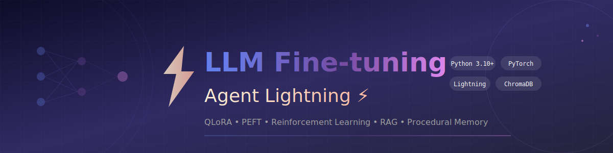

<p align="center">
  
</p>

<h1 align="center">🧠 LLM Fine-tuning con Agent Lightning + LUFFY + Search-R1</h1>

<p align="center">
  <strong>Un framework Python per addestrare modelli linguistici localmente, con Reinforcement Learning avanzato, ragionamento off-policy e ricerca integrata</strong>
</p>

<p align="center">
  <a href="#-la-storia-dietro-il-progetto">La Storia</a> •
  <a href="#-features-principali">Features</a> •
  <a href="#-luffy-off-policy-reasoning">LUFFY</a> •
  <a href="#-search-r1-reasoning-with-search">Search-R1</a> •
  <a href="#-architettura">Architettura</a> •
  <a href="DIAGRAMS.md">📊 Diagrammi</a> •
  <a href="#-citazioni-e-riferimenti">Citazioni</a>
</p>

<p align="center">
  
  
  
  
  
  
</p>

---

## 🎯 La Storia Dietro il Progetto

> *"Come posso far funzionare un modello da 7 miliardi di parametri sulla mia GPU da gaming?"*

Questa domanda, apparentemente semplice, è stata il punto di partenza di questo progetto.

Nel 2024, i Large Language Models hanno rivoluzionato il modo in cui interagiamo con le macchine. Ma c'era un problema: allenarli richiedeva cluster di GPU che costano milioni di euro. I modelli open-source esistevano, ma personalizzarli per task specifici sembrava un privilegio riservato ai grandi laboratori di ricerca.

**Questo progetto nasce per cambiare le regole del gioco.**

Ho combinato le tecniche più avanzate della ricerca recente — **QLoRA** per la quantizzazione, **PEFT** per l'efficienza parametrica, e **Agent Lightning** di Microsoft per il Reinforcement Learning — in un framework unificato che:

- ✅ Funziona su una singola GPU consumer (16GB VRAM)
- ✅ Supporta il training di agenti AI con capacità di ragionamento
- ✅ Include un sistema RAG completo per la memoria a lungo termine
- ✅ Implementa procedure operative standard (SOP) per comportamenti strutturati

Il risultato? **Un modello che può essere specializzato per coding, function calling, o qualsiasi altro task — sul tuo computer, con i tuoi dati.**

---

## ✨ Features Principali

### 🔬 Training Efficiente

| Feature | Descrizione | Impatto |
|---------|-------------|---------|
| **QLoRA 4-bit** | Quantizzazione NF4 con bitsandbytes | -75% VRAM usage |
| **PEFT/LoRA** | Solo ~1% parametri trainable | Training 50x più veloce |
| **Gradient Checkpointing** | Trade-off memoria/velocità | Modelli 2x più grandi |
| **Multi-Source Training** | Data mixing per modelli generalisti | No Catastrophic Forgetting |

### 🤖 Agent Lightning Integration

```
┌──────────────────────────────────────────────────────────────┐
│                    ALGORITMI DISPONIBILI                     │
├──────────────────────────────────────────────────────────────┤
│                                                              │
│  SFT ──────► Supervised Fine-Tuning classico                │
│              • Training iniziale                             │
│              • Dataset etichettati                           │
│                                                              │
│  GRPO ─────► Group Relative Policy Optimization             │
│              • Reinforcement Learning                        │
│              • Miglioramento comportamento agente            │
│              • Reward functions personalizzate               │
│                                                              │
│  APO ──────► Automatic Prompt Optimization                  │
│              • Ottimizza system prompt                       │
│              • Self-improvement del modello                  │
│                                                              │
└──────────────────────────────────────────────────────────────┘
```

### 🦊 LUFFY - Off-Policy Reasoning

**[LUFFY](https://github.com/ElliottYan/LUFFY)** (Learning to Reason under Off-Policy Guidance) è un framework per migliorare le capacità di ragionamento usando tracce off-policy da modelli avanzati come DeepSeek-R1.

```
┌──────────────────────────────────────────────────────────────┐
│                    LUFFY TRAINING FLOW                       │
├──────────────────────────────────────────────────────────────┤
│                                                              │
│  ┌─────────────┐    ┌─────────────┐    ┌─────────────┐     │
│  │ DeepSeek-R1 │    │ On-Policy   │    │   ExGRPO    │     │
│  │   Traces    │ +  │ Generations │ +  │ Experience  │     │
│  └──────┬──────┘    └──────┬──────┘    └──────┬──────┘     │
│         │                  │                  │             │
│         └──────────────────┴──────────────────┘             │
│                            │                                │
│                     Off-Policy Mixer                        │
│                            │                                │
│                    ┌───────▼───────┐                       │
│                    │  GRPO + KL    │                       │
│                    │  Policy Loss  │                       │
│                    └───────┬───────┘                       │
│                            │                                │
│                    Improved Reasoning                       │
│                                                              │
└──────────────────────────────────────────────────────────────┘
```

**Risultati benchmark (LUFFY su Qwen2.5-Math-7B):**

| Model | AIME 2024 | AIME 2025 | MATH-500 | Olympiad | Avg |
|-------|-----------|-----------|----------|----------|-----|
| Baseline | 11.5 | 4.9 | 43.6 | 15.6 | 19.0 |
| **LUFFY** | **29.4** | **23.1** | **87.6** | **57.2** | **50.1** |

### 🔍 Search-R1 - Reasoning with Search

**[Search-R1](https://github.com/PeterGriffinJin/Search-R1)** permette al modello di cercare informazioni durante il ragionamento, integrando retrieval e reasoning in modo fluido.

```
┌──────────────────────────────────────────────────────────────┐
│                  SEARCH-R1 REASONING FLOW                    │
├──────────────────────────────────────────────────────────────┤
│                                                              │
│   Question: "What is the capital with highest population?"  │
│                            │                                │
│                    ┌───────▼───────┐                       │
│                    │  Think Step 1 │                       │
│                    │  "I need to   │                       │
│                    │   search..."  │                       │
│                    └───────┬───────┘                       │
│                            │                                │
│                   <search>capital population</search>       │
│                            │                                │
│               ┌────────────▼────────────┐                  │
│               │    🔍 Search Engine     │                  │
│               │   Vector + BM25 Hybrid  │                  │
│               └────────────┬────────────┘                  │
│                            │                                │
│                   <context>results...</context>             │
│                            │                                │
│                    ┌───────▼───────┐                       │
│                    │  Think Step 2 │                       │
│                    │  "Based on    │                       │
│                    │   results..." │                       │
│                    └───────┬───────┘                       │
│                            │                                │
│                     Final Answer                            │
│                                                              │
└──────────────────────────────────────────────────────────────┘
```

### 🧠 Sistema di Memoria

```python
# RAG - Retrieval Augmented Generation
from src.memory import VectorStore, create_vector_store

store = create_vector_store(use_reranker=True)
store.add_documents(["La tua knowledge base..."])
results = store.query("Cos'è il machine learning?", n_results=3)

# SOP - Standard Operating Procedures
from src.memory import SOPManager, get_system_prompt_with_sop

manager = SOPManager(sop_directory="./data/sops")
prompt = get_system_prompt_with_sop("Aiutami a debuggare questo codice", manager)
```

### 📊 Smart Chunking

Ispirato a [osgrep](https://github.com/Ryandonofrio3/osgrep), il sistema di chunking usa **tree-sitter** per preservare i confini semantici del codice:

```
❌ Chunking tradizionale:          ✅ Smart Chunking:
                                    
"def calculate_tax(income,          "# Function: calculate_tax
  rate):                             def calculate_tax(income, rate):
    '''Calcola le tasse'''   ──►       '''Calcola le tasse'''
    tax = income * rate                tax = income * rate
    return tax"                        return tax"
    
(Taglio arbitrario)                 (Preserva la funzione intera)
```

---

## 🏗️ Architettura

```
┌─────────────────────────────────────────────────────────────────────────────┐
│                          ARCHITETTURA DEL SISTEMA                           │
└─────────────────────────────────────────────────────────────────────────────┘

                              ┌───────────────────┐
                              │   CONFIG (YAML)   │
                              │  ─────────────── │
                              │  • model         │
                              │  • datasets      │
                              │  • training      │
                              │  • agent_light.  │
                              └────────┬──────────┘
                                       │
           ┌───────────────────────────┼───────────────────────────┐
           │                           │                           │
           ▼                           ▼                           ▼
┌─────────────────────┐   ┌─────────────────────┐   ┌─────────────────────┐
│    MODEL LOADER     │   │    DATA MODULE      │   │   MEMORY SYSTEM     │
│   ───────────────   │   │   ───────────────   │   │   ───────────────   │
│                     │   │                     │   │                     │
│  ┌─────────────┐   │   │  ┌─────────────┐   │   │  ┌─────────────┐   │
│  │  HuggingFace │   │   │  │Multi-Source │   │   │  │ VectorStore │   │
│  │   Model      │   │   │  │  Dataset    │   │   │  │ (ChromaDB)  │   │
│  └──────┬──────┘   │   │  └──────┬──────┘   │   │  └──────┬──────┘   │
│         │          │   │         │          │   │         │          │
│  ┌──────▼──────┐   │   │  ┌──────▼──────┐   │   │  ┌──────▼──────┐   │
│  │   QLoRA     │   │   │  │  Formatter  │   │   │  │  Reranker   │   │
│  │   4-bit     │   │   │  │  (ChatML)   │   │   │  │ CrossEncoder│   │
│  └──────┬──────┘   │   │  └──────┬──────┘   │   │  └──────┬──────┘   │
│         │          │   │         │          │   │         │          │
│  ┌──────▼──────┐   │   │  ┌──────▼──────┐   │   │  ┌──────▼──────┐   │
│  │    PEFT     │   │   │  │ DataLoader  │   │   │  │    SOP      │   │
│  │    LoRA     │   │   │  │             │   │   │  │  Manager    │   │
│  └─────────────┘   │   │  └─────────────┘   │   │  └─────────────┘   │
│                     │   │                     │   │                     │
└──────────┬──────────┘   └──────────┬──────────┘   └──────────┬──────────┘
           │                         │                         │
           └─────────────────────────┼─────────────────────────┘
                                     │
                                     ▼
                    ┌────────────────────────────────┐
                    │        TRAINING AGENT          │
                    │       ────────────────         │
                    │                                │
                    │  ┌──────────────────────────┐ │
                    │  │  PyTorch Lightning       │ │
                    │  │  LightningModule         │ │
                    │  └────────────┬─────────────┘ │
                    │               │               │
                    │  ┌────────────▼─────────────┐ │
                    │  │  Agent Lightning         │ │
                    │  │  ┌─────┬─────┬─────┐    │ │
                    │  │  │ SFT │GRPO │ APO │    │ │
                    │  │  └─────┴─────┴─────┘    │ │
                    │  └────────────┬─────────────┘ │
                    │               │               │
                    │  ┌────────────▼─────────────┐ │
                    │  │   Reward Functions       │ │
                    │  │  • coding_reward         │ │
                    │  │  • function_calling      │ │
                    │  │  • chat_reward           │ │
                    │  └──────────────────────────┘ │
                    │                                │
                    └────────────────┬───────────────┘
                                     │
                                     ▼
                         ┌───────────────────────┐
                         │      CHECKPOINT       │
                         │     ───────────      │
                         │   LoRA Adapter +     │
                         │   Agent Config       │
                         └───────────────────────┘
```

---

## 🔧 Come Funziona

### 1️⃣ Il Problema della Memoria

Un modello come Mistral 7B richiede ~28GB di VRAM in float32. La mia GPU ha 16GB. Come risolverlo?

**QLoRA** (Quantized Low-Rank Adaptation) combina due tecniche:

```
┌────────────────────────────────────────────────────────────────┐
│                     QUANTIZZAZIONE NF4                         │
├────────────────────────────────────────────────────────────────┤
│                                                                │
│   float32 (32 bit) ──► NF4 (4 bit) = 8x meno memoria!         │
│                                                                │
│   Come funziona:                                               │
│   1. I pesi sono mappati su 16 valori predefiniti (4 bit)     │
│   2. Distribuzione "Normal Float" ottimizzata per LLM          │
│   3. Double quantization per i parametri di scaling            │
│                                                                │
│   Risultato: 7B parametri → ~4GB invece di ~28GB              │
│                                                                │
└────────────────────────────────────────────────────────────────┘

┌────────────────────────────────────────────────────────────────┐
│                         LoRA                                   │
├────────────────────────────────────────────────────────────────┤
│                                                                │
│   Invece di aggiornare TUTTI i pesi:                          │
│                                                                │
│   W_new = W_old + ΔW                                          │
│                                                                │
│   Decomponimo ΔW in due matrici piccole:                      │
│                                                                │
│   ΔW = A × B    dove A è (d × r) e B è (r × d)               │
│                                                                │
│   Se d = 4096 e r = 16:                                       │
│   • Prima: 4096 × 4096 = 16.7M parametri                      │
│   • Dopo:  4096 × 16 × 2 = 131K parametri (~127x meno!)       │
│                                                                │
└────────────────────────────────────────────────────────────────┘
```

### 2️⃣ Reinforcement Learning con GRPO

GRPO (Group Relative Policy Optimization) è l'algoritmo RL usato da Agent Lightning. Ecco come funziona:

```
                         GRPO TRAINING LOOP
                         ─────────────────
                         
  ┌──────────────────────────────────────────────────────────┐
  │ Per ogni prompt nel dataset:                              │
  │                                                           │
  │  1. Genera K risposte diverse (temperature > 0)          │
  │     ┌─────────┐                                           │
  │     │ Prompt  │──► [Risposta 1] [Risposta 2] [Risposta 3]│
  │     └─────────┘                                           │
  │                                                           │
  │  2. Calcola reward per ogni risposta                     │
  │     R(1) = 0.85  R(2) = 0.42  R(3) = 0.91               │
  │                                                           │
  │  3. Normalizza rewards relativamente                      │
  │     Advantage(i) = R(i) - mean(R)                        │
  │                                                           │
  │  4. Aggiorna policy per favorire risposte migliori       │
  │     Loss = -log(π(risposta|prompt)) × Advantage          │
  │                                                           │
  │  5. Aggiungi KL penalty per stabilità                    │
  │     Total_Loss = Policy_Loss + β × KL(π, π_ref)          │
  │                                                           │
  └──────────────────────────────────────────────────────────┘
```

### 3️⃣ Sistema RAG con Reranking

Il retrieval ha due fasi per massimizzare la precisione:

```
Query: "Come implemento il pattern Observer in Python?"
                           │
                           ▼
              ┌─────────────────────────┐
              │   FASE 1: Bi-Encoder    │
              │   (Recall veloce)       │
              └───────────┬─────────────┘
                          │
        Embedding query ──┼── Cosine similarity
                          │   con documenti indicizzati
                          ▼
              ┌─────────────────────────┐
              │  Top-K candidati (~20)  │
              │  Score: similarità      │
              └───────────┬─────────────┘
                          │
                          ▼
              ┌─────────────────────────┐
              │  FASE 2: Cross-Encoder  │
              │  (Precision accurata)   │
              └───────────┬─────────────┘
                          │
     Valuta ogni coppia ──┼── (query, documento)
     direttamente         │   con attention
                          ▼
              ┌─────────────────────────┐
              │   Top-N finali (~3)     │
              │   Score: rilevanza      │
              └─────────────────────────┘
```

---

## 💻 Il Codice Spiegato

### ModelLoader: Caricamento Efficiente

```python
# src/models/model_loader.py

class ModelLoader:
    """
    Il cuore del caricamento modelli.
    
    Gestisce la complessità di:
    - Scaricare modelli da HuggingFace
    - Applicare quantizzazione 4-bit
    - Configurare LoRA per fine-tuning efficiente
    """
    
    def load_model(self, enable_gradient_checkpointing: bool = True):
        # 1. Configura bitsandbytes per quantizzazione
        bnb_config = BitsAndBytesConfig(
            load_in_4bit=True,
            bnb_4bit_compute_dtype=torch.float16,
            bnb_4bit_quant_type="nf4",           # Normal Float 4-bit
            bnb_4bit_use_double_quant=True,       # Quantizza anche i parametri
        )
        
        # 2. Carica il modello quantizzato
        model = AutoModelForCausalLM.from_pretrained(
            self.model_name_or_path,
            quantization_config=bnb_config,
            device_map="auto",  # Distribuisce automaticamente su GPU
        )
        
        # 3. Prepara per training k-bit (congela layers base)
        model = prepare_model_for_kbit_training(model)
        
        # 4. Applica LoRA (aggiunge adattatori trainable)
        lora_config = LoraConfig(
            r=16,                    # Rank della decomposizione
            lora_alpha=32,           # Scaling factor
            target_modules=[         # Quali layer modificare
                "q_proj", "k_proj", "v_proj", "o_proj",
                "gate_proj", "up_proj", "down_proj",
            ],
            lora_dropout=0.1,
        )
        model = get_peft_model(model, lora_config)
        
        # Ora solo ~1% dei parametri è trainable!
        model.print_trainable_parameters()
        # Output: "trainable params: 13M || all params: 7B || 0.18%"
        
        return model
```

### RewardFunction: Valutazione Automatica

```python
# src/agent/agent_lightning_trainer.py

class RewardFunction:
    """
    Il "giudice" che valuta le generazioni del modello.
    
    Senza reward function, il modello non sa cosa migliorare.
    Con reward function, impara a generare risposte migliori.
    """
    
    @staticmethod
    def coding_reward(prompt: str, generation: str) -> float:
        """
        Valuta la qualità del codice generato.
        
        Criteri:
        - Sintassi corretta (parsabile)
        - Presenza di docstring
        - Type hints
        - Lunghezza appropriata
        """
        reward = 0.0
        
        # Estrai codice dalla risposta
        code_blocks = re.findall(r'```python\n?(.*?)```', generation, re.DOTALL)
        if not code_blocks:
            return -0.5  # Penalizza assenza di codice
        
        code = code_blocks[0]
        
        # Verifica sintassi
        try:
            compile(code, '<string>', 'exec')
            reward += 0.3  # +0.3 per sintassi corretta
        except SyntaxError:
            reward -= 0.3  # -0.3 per errori
        
        # Bonus per best practices
        if '"""' in code:           reward += 0.1  # Docstring
        if ': ' in code and '->':   reward += 0.1  # Type hints
        if 50 < len(code) < 2000:   reward += 0.1  # Lunghezza ragionevole
        
        return max(-1.0, min(1.0, reward))
    
    @staticmethod
    def combined_reward(prompt: str, generation: str) -> float:
        """
        Auto-detect del task type e applica reward appropriato.
        
        Il modello impara a essere bravo in tutto!
        """
        prompt_lower = prompt.lower()
        
        if any(kw in prompt_lower for kw in ['function', 'tool', 'api']):
            return RewardFunction.function_calling_reward(...)
        elif any(kw in prompt_lower for kw in ['code', 'python', 'write']):
            return RewardFunction.coding_reward(...)
        else:
            return RewardFunction.chat_reward(...)
```

### SmartChunker: Chunking Semantico

```python
# src/memory/smart_chunker.py

class SmartChunker:
    """
    Chunker che capisce la struttura del codice.
    
    A differenza del chunking per caratteri, questo:
    - Preserva funzioni complete
    - Mantiene classi con i loro metodi
    - Include contesto per gli embedding
    """
    
    def chunk_python_code(self, code: str, file_path: str):
        # Usa tree-sitter per parsing AST
        parser = self._get_parser("python")
        tree = parser.parse(code.encode())
        
        chunks = []
        
        def process_node(node, parent_class=None):
            if node.type == "function_definition":
                # Estrai la funzione intera
                chunk = CodeChunk(
                    content=self._get_node_text(node),
                    chunk_type=ChunkType.METHOD if parent_class else ChunkType.FUNCTION,
                    name=self._get_node_name(node),
                    docstring=self._extract_docstring(node),
                    parent=parent_class,
                )
                chunks.append(chunk)
                
            elif node.type == "class_definition":
                # Per classi grandi, estrai i metodi separatamente
                class_name = self._get_node_name(node)
                for child in node.children:
                    process_node(child, parent_class=class_name)
        
        # Processa l'AST
        process_node(tree.root_node)
        
        return chunks
    
    def to_embedding_text(self, chunk: CodeChunk) -> str:
        """
        Genera testo ottimizzato per embedding.
        
        Aggiunge contesto per migliorare la ricerca semantica.
        """
        parts = []
        
        # Header con metadata
        if chunk.chunk_type == ChunkType.FUNCTION:
            parts.append(f"# Function: {chunk.name}")
        elif chunk.chunk_type == ChunkType.METHOD:
            parts.append(f"# Method: {chunk.parent}.{chunk.name}")
        
        # Docstring come descrizione
        if chunk.docstring:
            parts.append(f"# Description: {chunk.docstring[:200]}")
        
        # Il codice vero e proprio
        parts.append(chunk.content)
        
        return "\n".join(parts)
```

---

## 📚 Citazioni e Riferimenti

Questo progetto si basa su ricerca e strumenti open source. Ecco i contributi che hanno reso tutto possibile:

### 📄 Paper Accademici

| Paper | Autori | Contributo |
|-------|--------|------------|
| **[LUFFY](https://arxiv.org/abs/2504.14945)** 🆕 | Yan et al. (2025) | Off-Policy Reasoning Learning (NeurIPS 2025) |
| **[DeepSeek-R1](https://arxiv.org/abs/2501.12948)** 🆕 | DeepSeek (2025) | Reinforcement Learning per Reasoning |
| **[ExGRPO](https://arxiv.org/abs/2510.02245)** 🆕 | Zhan et al. (2025) | Learning from Model's Own Experience |
| **[QLoRA](https://arxiv.org/abs/2305.14314)** | Dettmers et al. (2023) | Quantizzazione 4-bit per fine-tuning efficiente |
| **[LoRA](https://arxiv.org/abs/2106.09685)** | Hu et al. (2021) | Low-Rank Adaptation per PEFT |
| **[GRPO](https://arxiv.org/abs/2402.03300)** | Shao et al. (2024) | Group Relative Policy Optimization |
| **[ColBERT](https://arxiv.org/abs/2004.12832)** | Khattab & Zaharia (2020) | Late interaction per reranking |

### 🛠️ Librerie e Framework

| Progetto | Licenza | Uso in questo progetto |
|----------|---------|------------------------|
| [LUFFY](https://github.com/ElliottYan/LUFFY) 🆕 | MIT | Off-Policy Reasoning Learning |
| [Search-R1](https://github.com/PeterGriffinJin/Search-R1) 🆕 | MIT | Reasoning with Search Integration |
| [veRL](https://github.com/volcengine/verl) 🆕 | Apache 2.0 | Scalable RL Training |
| [vLLM](https://github.com/vllm-project/vllm) 🆕 | Apache 2.0 | Fast Inference for RL |
| [Microsoft Agent Lightning](https://github.com/microsoft/agent-lightning) | MIT | Training RL per agenti AI |
| [HuggingFace Transformers](https://github.com/huggingface/transformers) | Apache 2.0 | Modelli e tokenizer |
| [PyTorch Lightning](https://github.com/Lightning-AI/lightning) | Apache 2.0 | Orchestrazione training |
| [PEFT](https://github.com/huggingface/peft) | Apache 2.0 | LoRA e altri adapter |
| [bitsandbytes](https://github.com/TimDettmers/bitsandbytes) | MIT | Quantizzazione 4-bit |
| [ChromaDB](https://github.com/chroma-core/chroma) | Apache 2.0 | Vector database per RAG |
| [FAISS](https://github.com/facebookresearch/faiss) 🆕 | MIT | Vector similarity search |
| [Sentence Transformers](https://github.com/UKPLab/sentence-transformers) | Apache 2.0 | Embedding e reranking |
| [tree-sitter](https://github.com/tree-sitter/tree-sitter) | MIT | Parsing AST per chunking |

### 💡 Ispirazione

- **[LUFFY](https://github.com/ElliottYan/LUFFY)** 🆕 - Off-policy learning per reasoning models
- **[Search-R1](https://github.com/PeterGriffinJin/Search-R1)** 🆕 - Reasoning con ricerca integrata
- **[DeepSeek-R1](https://api-docs.deepseek.com/)** 🆕 - Reasoning traces per training
- **[osgrep](https://github.com/Ryandonofrio3/osgrep)** - Ispirazione per smart chunking e reranking
- **[LlamaIndex](https://github.com/run-llama/llama_index)** - Pattern architetturali per RAG
- **[LangChain](https://github.com/langchain-ai/langchain)** - Integrazioni document loaders

---

## 📊 Benchmark e Risultati

### Memory Usage (Mistral 7B)

| Configurazione | VRAM | Trainable Params |
|----------------|------|------------------|
| Full Fine-tuning (FP32) | ~28GB | 7B (100%) |
| Full Fine-tuning (FP16) | ~14GB | 7B (100%) |
| **QLoRA 4-bit + LoRA** | **~6GB** | **13M (0.18%)** |

### Training Speed

```
┌─────────────────────────────────────────────────────────────┐
│            TEMPO PER 1000 STEP (Mistral 7B)                 │
├─────────────────────────────────────────────────────────────┤
│                                                             │
│  Full FP32:     ████████████████████████████ ~4 ore        │
│  Full FP16:     ██████████████ ~2 ore                      │
│  QLoRA + LoRA:  ████ ~30 min                               │
│                                                             │
│  (RTX 4090, batch_size=2, gradient_accumulation=8)         │
│                                                             │
└─────────────────────────────────────────────────────────────┘
```

---

## 🚀 Quick Start

```bash
# 1. Clona il progetto
git clone https://github.com/tuousername/llm-finetuning-agent-lightning.git
cd llm-finetuning-agent-lightning

# 2. Installa dipendenze
pip install -e .

# 3. Training classico (PyTorch Lightning)
python main.py --config config/config.yaml

# 4. Training RL con Agent Lightning
python main_agent_lightning.py --config config/config.yaml

# 5. Training con LUFFY (Off-Policy Reasoning) 🆕
python main_reasoning.py --mode luffy --config config/config.yaml

# 6. Training con Search-R1 (Reasoning + Search) 🆕
python main_reasoning.py --mode search-r1 --config config/config.yaml --kb ./data/knowledge_base

# 7. Training combinato LUFFY + Search-R1 🆕
python main_reasoning.py --mode combined --config config/config.yaml
```

### Opzioni avanzate per reasoning:

```bash
# Carica tracce off-policy da DeepSeek-R1
python main_reasoning.py --mode luffy --traces ./data/deepseek_r1_traces.json

# Verifica configurazione senza training
python main_reasoning.py --mode combined --dry-run
```

---

## 📝 Struttura del Progetto

```
.
├── config/
│   └── config.yaml              # Configurazione principale (include LUFFY/Search-R1)
├── src/
│   ├── models/
│   │   └── model_loader.py      # Caricamento modelli con QLoRA
│   ├── data/
│   │   └── data_module.py       # DataModule + Multi-Source Training
│   ├── agent/
│   │   ├── training_agent.py    # LightningModule per training
│   │   ├── agent_lightning_trainer.py  # Agent Lightning RL
│   │   └── tools.py             # Definizioni tool per agenti
│   ├── memory/
│   │   ├── vector_store.py      # VectorStore (ChromaDB + Reranker)
│   │   ├── procedural_memory.py # SOP Manager
│   │   └── smart_chunker.py     # Smart chunking con tree-sitter
│   └── reasoning/               # 🆕 Modulo LUFFY + Search-R1
│       ├── __init__.py
│       ├── luffy_trainer.py     # LUFFY: Off-Policy Reasoning Learning
│       └── search_r1.py         # Search-R1: Reasoning with Search
├── data/
│   ├── sops/                    # SOP personalizzate
│   └── reasoning_traces/        # 🆕 Tracce off-policy (DeepSeek-R1)
├── main.py                      # Entry point (PyTorch Lightning)
├── main_agent_lightning.py      # Entry point (Agent Lightning RL)
├── main_reasoning.py            # 🆕 Entry point (LUFFY + Search-R1)
└── README.md
```

---

## 👤 Autore

**[Alessandro Boni]**

- 🌐 Portfolio: [tuo-sito.com](https://alessandroboni.netlify.app/)
- 💼 LinkedIn: [linkedin.com/in/tuoprofilo](https://www.linkedin.com/in/alessandro-boni-503129172/)
- 🐙 GitHub: [@SandroHub013](https://github.com/SandroHub013)

---

## 📄 Licenza

Questo progetto è rilasciato sotto licenza **MIT**.

```
MIT License

Copyright (c) 2024 [Il Tuo Nome]

Permission is hereby granted, free of charge, to any person obtaining a copy
of this software and associated documentation files (the "Software"), to deal
in the Software without restriction, including without limitation the rights
to use, copy, modify, merge, publish, distribute, sublicense, and/or sell
copies of the Software...
```

---

<p align="center">
  <sub>Built with ❤️ and lots of ☕ for the AI community</sub>
</p>


