<p align="center">
  
</p>

<h1 align="center">🧠 LLM Fine-tuning with Agent Lightning + LUFFY + Search-R1</h1>

<p align="center">
  <strong>A Python framework for training language models locally, with advanced Reinforcement Learning, off-policy reasoning, and integrated search</strong>
</p>

<p align="center">
  <a href="#-the-story-behind-the-project">The Story</a> •
  <a href="#-main-features">Features</a> •
  <a href="#-luffy-off-policy-reasoning">LUFFY</a> •
  <a href="#-search-r1-reasoning-with-search">Search-R1</a> •
  <a href="#-architecture">Architecture</a> •
  <a href="DIAGRAMS.md">📊 Diagrams</a> •
  <a href="#-citations-and-references">Citations</a>
</p>

<p align="center">
  
  
  
  
  
  
</p>

---

## 🎯 The Story Behind the Project

> *"How can I run a 7-billion parameter model on my gaming GPU?"*

This seemingly simple question was the starting point for this project.

In 2024, Large Language Models revolutionized how we interact with machines. But there was a problem: training them required GPU clusters costing millions of dollars. Open-source models existed, but customizing them for specific tasks seemed like a privilege reserved for major research labs.

**This project was born to change the rules of the game.**

I combined the most advanced techniques from recent research — **QLoRA** for quantization, **PEFT** for parameter efficiency, and Microsoft's **Agent Lightning** for Reinforcement Learning — into a unified framework that:

- ✅ Runs on a single consumer GPU (16GB VRAM)
- ✅ Supports training AI agents with reasoning capabilities
- ✅ Includes a complete RAG system for long-term memory
- ✅ Implements Standard Operating Procedures (SOP) for structured behaviors

The result? **A model that can be specialized for coding, function calling, or any other task — on your computer, with your data.**

---

## ✨ Main Features

### 🔬 Efficient Training

| Feature | Description | Impact |
|---------|-------------|--------|
| **QLoRA 4-bit** | NF4 quantization with bitsandbytes | -75% VRAM usage |
| **PEFT/LoRA** | Only ~1% trainable parameters | 50x faster training |
| **Gradient Checkpointing** | Memory/speed trade-off | 2x larger models |
| **Multi-Source Training** | Data mixing for generalist models | No Catastrophic Forgetting |

### 🤖 Agent Lightning Integration

```mermaid
flowchart TB
    subgraph ALGORITHMS["AVAILABLE ALGORITHMS"]
        SFT["SFT<br/>Supervised Fine-Tuning<br/>• Initial training<br/>• Labeled datasets"]
        GRPO["GRPO<br/>Group Relative Policy Optimization<br/>• Reinforcement Learning<br/>• Agent behavior improvement<br/>• Custom reward functions"]
        APO["APO<br/>Automatic Prompt Optimization<br/>• System prompt optimization<br/>• Model self-improvement"]
    end
    
    style ALGORITHMS fill:#1a1a2e,stroke:#16213e,color:#fff
    style SFT fill:#0984e3,stroke:#74b9ff,color:#fff
    style GRPO fill:#6c5ce7,stroke:#a29bfe,color:#fff
    style APO fill:#00b894,stroke:#00cec9,color:#fff
```



### 🦊 LUFFY - Off-Policy Reasoning

**[LUFFY](https://github.com/ElliottYan/LUFFY)** (Learning to Reason under Off-Policy Guidance) is a framework for improving reasoning capabilities using off-policy traces from advanced models like DeepSeek-R1.


**Benchmark results (LUFFY on Qwen2.5-Math-7B):**

| Model | AIME 2024 | AIME 2025 | MATH-500 | Olympiad | Avg |
|-------|-----------|-----------|----------|----------|-----|
| Baseline | 11.5 | 4.9 | 43.6 | 15.6 | 19.0 |
| **LUFFY** | **29.4** | **23.1** | **87.6** | **57.2** | **50.1** |

### 🔍 Search-R1 - Reasoning with Search

**[Search-R1](https://github.com/PeterGriffinJin/Search-R1)** enables the model to search for information during reasoning, seamlessly integrating retrieval and reasoning.

```mermaid
flowchart TD
    Q["Question: What is the tallest mountain?"]
    
    Q --> THINK1["🧠 Think Step 1<br/>Let me search for this..."]
    
    THINK1 --> SEARCH["&lt;search&gt;tallest mountain world&lt;/search&gt;"]
    
    SEARCH --> ENGINE["🔍 Hybrid Search Engine"]
    
    subgraph HYBRID["Hybrid Search"]
        VEC["Vector Search<br/>(Semantic)"]
        BM25["BM25 Search<br/>(Keywords)"]
        RRF["Reciprocal Rank<br/>Fusion"]
        
        VEC --> RRF
        BM25 --> RRF
    end
    
    ENGINE --> HYBRID
    RRF --> RESULTS["Top-3 Results"]
    
    RESULTS --> CTX["&lt;context&gt;<br/>[1] Mount Everest 8,849m...<br/>[2] K2 8,611m...<br/>[3] Kangchenjunga 8,586m...<br/>&lt;/context&gt;"]
    
    CTX --> THINK2["🧠 Think Step 2<br/>Based on the search results..."]
    
    THINK2 --> ANSWER["✅ Answer: Mount Everest<br/>at 8,849 meters"]
    
    subgraph REWARD["RL Reward"]
        R1["Correctness: +0.7"]
        R2["Search Bonus: +0.1"]
        R3["Reasoning: +0.2"]
    end
    
    ANSWER --> REWARD

    style Q fill:#74b9ff,stroke:#0984e3,color:#000
    style ENGINE fill:#e17055,stroke:#d63031,color:#fff
    style ANSWER fill:#00b894,stroke:#00cec9,color:#fff
    style HYBRID fill:#0f3460,stroke:#16213e,color:#fff
```



### 🧠 Memory System

```python
# RAG - Retrieval Augmented Generation
from src.memory import VectorStore, create_vector_store

store = create_vector_store(use_reranker=True)
store.add_documents(["Your knowledge base..."])
results = store.query("What is machine learning?", n_results=3)

# SOP - Standard Operating Procedures
from src.memory import SOPManager, get_system_prompt_with_sop

manager = SOPManager(sop_directory="./data/sops")
prompt = get_system_prompt_with_sop("Help me debug this code", manager)
```

### 📊 Smart Chunking

Inspired by [osgrep](https://github.com/Ryandonofrio3/osgrep), the chunking system uses **tree-sitter** to preserve semantic boundaries in code:


---

## 🏗️ Architecture


---

## 🔧 How It Works

### 1️⃣ The Memory Problem

A model like Mistral 7B requires ~28GB of VRAM in float32. My GPU has 16GB. How to solve this?

**QLoRA** (Quantized Low-Rank Adaptation) combines two techniques:

```mermaid
flowchart TB
    subgraph QUANT["NF4 QUANTIZATION"]
        Q1["float32 (32 bit) → NF4 (4 bit) = 8x less memory!"]
        Q2["How it works:<br/>1. Weights mapped to 16 predefined values (4 bit)<br/>2. 'Normal Float' distribution optimized for LLMs<br/>3. Double quantization for scaling parameters"]
        Q3["Result: 7B parameters → ~4GB instead of ~28GB"]
    end
    
    subgraph LORA["LoRA"]
        L1["Instead of updating ALL weights:<br/>W_new = W_old + ΔW"]
        L2["Decompose ΔW into two small matrices:<br/>ΔW = A × B where A is (d × r) and B is (r × d)"]
        L3["If d = 4096 and r = 16:<br/>• Before: 4096 × 4096 = 16.7M parameters<br/>• After: 4096 × 16 × 2 = 131K parameters (~127x less!)"]
    end
    
    QUANT --> LORA

    style QUANT fill:#e17055,stroke:#d63031,color:#fff
    style LORA fill:#6c5ce7,stroke:#a29bfe,color:#fff
```



### 2️⃣ Reinforcement Learning with GRPO

GRPO (Group Relative Policy Optimization) is the RL algorithm used by Agent Lightning. Here's how it works:


### 3️⃣ RAG System with Reranking

Retrieval has two phases to maximize precision:


---

## 💻 Code Explained

### ModelLoader: Efficient Loading

```python
# src/models/model_loader.py

class ModelLoader:
    """
    The heart of model loading.
    
    Handles the complexity of:
    - Downloading models from HuggingFace
    - Applying 4-bit quantization
    - Configuring LoRA for efficient fine-tuning
    """
    
    def load_model(self, enable_gradient_checkpointing: bool = True):
        # 1. Configure bitsandbytes for quantization
        bnb_config = BitsAndBytesConfig(
            load_in_4bit=True,
            bnb_4bit_compute_dtype=torch.float16,
            bnb_4bit_quant_type="nf4",           # Normal Float 4-bit
            bnb_4bit_use_double_quant=True,       # Also quantize parameters
        )
        
        # 2. Load the quantized model
        model = AutoModelForCausalLM.from_pretrained(
            self.model_name_or_path,
            quantization_config=bnb_config,
            device_map="auto",  # Automatically distribute across GPU
        )
        
        # 3. Prepare for k-bit training (freeze base layers)
        model = prepare_model_for_kbit_training(model)
        
        # 4. Apply LoRA (add trainable adapters)
        lora_config = LoraConfig(
            r=16,                    # Decomposition rank
            lora_alpha=32,           # Scaling factor
            target_modules=[         # Which layers to modify
                "q_proj", "k_proj", "v_proj", "o_proj",
                "gate_proj", "up_proj", "down_proj",
            ],
            lora_dropout=0.1,
        )
        model = get_peft_model(model, lora_config)
        
        # Now only ~1% of parameters are trainable!
        model.print_trainable_parameters()
        # Output: "trainable params: 13M || all params: 7B || 0.18%"
        
        return model
```

### RewardFunction: Automatic Evaluation

```python
# src/agent/agent_lightning_trainer.py

class RewardFunction:
    """
    The "judge" that evaluates model generations.
    
    Without a reward function, the model doesn't know what to improve.
    With a reward function, it learns to generate better responses.
    """
    
    @staticmethod
    def coding_reward(prompt: str, generation: str) -> float:
        """
        Evaluates the quality of generated code.
        
        Criteria:
        - Correct syntax (parseable)
        - Presence of docstrings
        - Type hints
        - Appropriate length
        """
        reward = 0.0
        
        # Extract code from response
        code_blocks = re.findall(r'```python\n?(.*?)```', generation, re.DOTALL)
        if not code_blocks:
            return -0.5  # Penalize absence of code
        
        code = code_blocks[0]
        
        # Verify syntax
        try:
            compile(code, '<string>', 'exec')
            reward += 0.3  # +0.3 for correct syntax
        except SyntaxError:
            reward -= 0.3  # -0.3 for errors
        
        # Bonus for best practices
        if '"""' in code:           reward += 0.1  # Docstring
        if ': ' in code and '->':   reward += 0.1  # Type hints
        if 50 < len(code) < 2000:   reward += 0.1  # Reasonable length
        
        return max(-1.0, min(1.0, reward))
    
    @staticmethod
    def combined_reward(prompt: str, generation: str) -> float:
        """
        Auto-detect task type and apply appropriate reward.
        
        The model learns to be good at everything!
        """
        prompt_lower = prompt.lower()
        
        if any(kw in prompt_lower for kw in ['function', 'tool', 'api']):
            return RewardFunction.function_calling_reward(...)
        elif any(kw in prompt_lower for kw in ['code', 'python', 'write']):
            return RewardFunction.coding_reward(...)
        else:
            return RewardFunction.chat_reward(...)
```

### SmartChunker: Semantic Chunking

```python
# src/memory/smart_chunker.py

class SmartChunker:
    """
    Chunker that understands code structure.
    
    Unlike character-based chunking, this:
    - Preserves complete functions
    - Keeps classes with their methods
    - Includes context for embeddings
    """
    
    def chunk_python_code(self, code: str, file_path: str):
        # Use tree-sitter for AST parsing
        parser = self._get_parser("python")
        tree = parser.parse(code.encode())
        
        chunks = []
        
        def process_node(node, parent_class=None):
            if node.type == "function_definition":
                # Extract the entire function
                chunk = CodeChunk(
                    content=self._get_node_text(node),
                    chunk_type=ChunkType.METHOD if parent_class else ChunkType.FUNCTION,
                    name=self._get_node_name(node),
                    docstring=self._extract_docstring(node),
                    parent=parent_class,
                )
                chunks.append(chunk)
                
            elif node.type == "class_definition":
                # For large classes, extract methods separately
                class_name = self._get_node_name(node)
                for child in node.children:
                    process_node(child, parent_class=class_name)
        
        # Process the AST
        process_node(tree.root_node)
        
        return chunks
    
    def to_embedding_text(self, chunk: CodeChunk) -> str:
        """
        Generate text optimized for embedding.
        
        Adds context to improve semantic search.
        """
        parts = []
        
        # Header with metadata
        if chunk.chunk_type == ChunkType.FUNCTION:
            parts.append(f"# Function: {chunk.name}")
        elif chunk.chunk_type == ChunkType.METHOD:
            parts.append(f"# Method: {chunk.parent}.{chunk.name}")
        
        # Docstring as description
        if chunk.docstring:
            parts.append(f"# Description: {chunk.docstring[:200]}")
        
        # The actual code
        parts.append(chunk.content)
        
        return "\n".join(parts)
```

---

## 📚 Citations and References

This project builds on research and open-source tools. Here are the contributions that made everything possible:

### 📄 Academic Papers

| Paper | Authors | Contribution |
|-------|---------|--------------|
| **[LUFFY](https://arxiv.org/abs/2504.14945)** 🆕 | Yan et al. (2025) | Off-Policy Reasoning Learning (NeurIPS 2025) |
| **[DeepSeek-R1](https://arxiv.org/abs/2501.12948)** 🆕 | DeepSeek (2025) | Reinforcement Learning for Reasoning |
| **[ExGRPO](https://arxiv.org/abs/2510.02245)** 🆕 | Zhan et al. (2025) | Learning from Model's Own Experience |
| **[QLoRA](https://arxiv.org/abs/2305.14314)** | Dettmers et al. (2023) | 4-bit Quantization for Efficient Fine-tuning |
| **[LoRA](https://arxiv.org/abs/2106.09685)** | Hu et al. (2021) | Low-Rank Adaptation for PEFT |
| **[GRPO](https://arxiv.org/abs/2402.03300)** | Shao et al. (2024) | Group Relative Policy Optimization |
| **[ColBERT](https://arxiv.org/abs/2004.12832)** | Khattab & Zaharia (2020) | Late Interaction for Reranking |

### 🛠️ Libraries and Frameworks

| Project | License | Use in This Project |
|---------|---------|---------------------|
| [LUFFY](https://github.com/ElliottYan/LUFFY) 🆕 | MIT | Off-Policy Reasoning Learning |
| [Search-R1](https://github.com/PeterGriffinJin/Search-R1) 🆕 | MIT | Reasoning with Search Integration |
| [veRL](https://github.com/volcengine/verl) 🆕 | Apache 2.0 | Scalable RL Training |
| [vLLM](https://github.com/vllm-project/vllm) 🆕 | Apache 2.0 | Fast Inference for RL |
| [Microsoft Agent Lightning](https://github.com/microsoft/agent-lightning) | MIT | RL Training for AI Agents |
| [HuggingFace Transformers](https://github.com/huggingface/transformers) | Apache 2.0 | Models and Tokenizers |
| [PyTorch Lightning](https://github.com/Lightning-AI/lightning) | Apache 2.0 | Training Orchestration |
| [PEFT](https://github.com/huggingface/peft) | Apache 2.0 | LoRA and Other Adapters |
| [bitsandbytes](https://github.com/TimDettmers/bitsandbytes) | MIT | 4-bit Quantization |
| [ChromaDB](https://github.com/chroma-core/chroma) | Apache 2.0 | Vector Database for RAG |
| [FAISS](https://github.com/facebookresearch/faiss) 🆕 | MIT | Vector Similarity Search |
| [Sentence Transformers](https://github.com/UKPLab/sentence-transformers) | Apache 2.0 | Embedding and Reranking |
| [tree-sitter](https://github.com/tree-sitter/tree-sitter) | MIT | AST Parsing for Chunking |

### 💡 Inspiration

- **[LUFFY](https://github.com/ElliottYan/LUFFY)** 🆕 - Off-policy learning for reasoning models
- **[Search-R1](https://github.com/PeterGriffinJin/Search-R1)** 🆕 - Reasoning with integrated search
- **[DeepSeek-R1](https://api-docs.deepseek.com/)** 🆕 - Reasoning traces for training
- **[osgrep](https://github.com/Ryandonofrio3/osgrep)** - Inspiration for smart chunking and reranking
- **[LlamaIndex](https://github.com/run-llama/llama_index)** - Architectural patterns for RAG
- **[LangChain](https://github.com/langchain-ai/langchain)** - Document loader integrations

---

## 📊 Benchmarks and Results

### Memory Usage (Mistral 7B)

| Configuration | VRAM | Trainable Params |
|---------------|------|------------------|
| Full Fine-tuning (FP32) | ~28GB | 7B (100%) |
| Full Fine-tuning (FP16) | ~14GB | 7B (100%) |
| **QLoRA 4-bit + LoRA** | **~6GB** | **13M (0.18%)** |

### Training Speed

```
┌─────────────────────────────────────────────────────────────┐
│              TIME PER 1000 STEPS (Mistral 7B)               │
├─────────────────────────────────────────────────────────────┤
│                                                             │
│  Full FP32:     ████████████████████████████ ~4 hours      │
│  Full FP16:     ██████████████ ~2 hours                    │
│  QLoRA + LoRA:  ████ ~30 min                               │
│                                                             │
│  (RTX 4090, batch_size=2, gradient_accumulation=8)         │
│                                                             │
└─────────────────────────────────────────────────────────────┘
```

---

## 🚀 Quick Start

```bash
# 1. Clone the project
git clone https://github.com/SandroHub013/ALCHEMY.git
cd ALCHEMY

# 2. Install dependencies
pip install -e .

# 3. Classic training (PyTorch Lightning)
python main.py --config config/config.yaml

# 4. RL training with Agent Lightning
python main_agent_lightning.py --config config/config.yaml

# 5. Training with LUFFY (Off-Policy Reasoning) 🆕
python main_reasoning.py --mode luffy --config config/config.yaml

# 6. Training with Search-R1 (Reasoning + Search) 🆕
python main_reasoning.py --mode search-r1 --config config/config.yaml --kb ./data/knowledge_base

# 7. Combined LUFFY + Search-R1 training 🆕
python main_reasoning.py --mode combined --config config/config.yaml
```

### Advanced reasoning options:

```bash
# Load off-policy traces from DeepSeek-R1
python main_reasoning.py --mode luffy --traces ./data/deepseek_r1_traces.json

# Verify configuration without training
python main_reasoning.py --mode combined --dry-run
```

---

## 📝 Project Structure


---

## 👤 Author

**[Alessandro Boni]**

- 🌐 Portfolio: [alessandroboni.netlify.app](https://alessandroboni.netlify.app/)
- 💼 LinkedIn: [linkedin.com/in/alessandro-boni-503129172](https://www.linkedin.com/in/alessandro-boni-503129172/)
- 🐙 GitHub: [@SandroHub013](https://github.com/SandroHub013)

---

## 📄 License

This project is released under the **MIT** license.

```
MIT License

Copyright (c) 2024 [ALCHEMY]

Permission is hereby granted, free of charge, to any person obtaining a copy
of this software and associated documentation files (the "Software"), to deal
in the Software without restriction, including without limitation the rights
to use, copy, modify, merge, publish, distribute, sublicense, and/or sell
copies of the Software...
```

---

<p align="center">
  <sub>Built with ❤️ and lots of ☕ for the AI community</sub>
</p>


