<p align="center">
  
</p>

<h1 align="center">🧪 ALCHEMY</h1>
<h3 align="center">Advanced LLM Training Framework with Multi-Agent Orchestration</h3>

<p align="center">
  <strong>Fine-tune language models locally with Reinforcement Learning, Multi-Agent Swarms, and Adaptive Training</strong>
</p>

<p align="center">
  <a href="#-features">Features</a> •
  <a href="#-new-integrations">New Integrations</a> •
  <a href="#-architecture">Architecture</a> •
  <a href="#-quick-start">Quick Start</a> •
  <a href="#-citations">Citations</a> •
  <a href="#-license">License</a>
</p>

<p align="center">
  
  
  
  
  
</p>

<p align="center">
  
  
  
</p>

---

## 🎯 What is ALCHEMY?

ALCHEMY is a comprehensive Python framework for training Large Language Models on consumer GPUs. It combines cutting-edge research in:

- **Efficient Training** — QLoRA, LoRA, gradient checkpointing
- **Reinforcement Learning** — GRPO, DPO, PPO for behavior optimization
- **Multi-Agent Systems** — Swarm intelligence for parallel exploration
- **Adaptive Training** — Dynamic hyperparameter optimization
- **Memory Systems** — RAG, smart chunking, procedural memory

**Key Achievement:** Train 7B+ models on an **8GB GPU** with full RL capabilities.

---

## ✨ Features

### Core Training Capabilities

| Feature | Description | Impact |
|---------|-------------|--------|
| **QLoRA 4-bit** | NF4 quantization with bitsandbytes | **-75% VRAM** |
| **Unsloth Integration** | Optimized kernels for training | **2x faster, 70% less VRAM** |
| **PEFT/LoRA** | Only ~1% trainable parameters | **50x faster training** |
| **Multi-Source Training** | Data mixing for generalist models | **No Catastrophic Forgetting** |
| **Gradient Checkpointing** | Memory/speed trade-off | **2x larger models** |

### Reinforcement Learning

| Algorithm | Description | Use Case |
|-----------|-------------|----------|
| **GRPO** | Group Relative Policy Optimization | General RL training |
| **DPO** | Direct Preference Optimization | Preference learning |
| **ORPO** | Odds Ratio Preference Optimization | Efficient alignment |
| **APO** | Automatic Prompt Optimization | Prompt tuning |

### Advanced Systems

| System | Description |
|--------|-------------|
| **LUFFY** | Off-policy reasoning with DeepSeek-R1 traces |
| **Search-R1** | Reasoning with integrated search |
| **RAG + Reranking** | Two-phase retrieval with CrossEncoder |
| **Smart Chunking** | AST-aware code chunking with tree-sitter |
| **SOP Memory** | Standard Operating Procedures for agents |

---

## 🆕 New Integrations

ALCHEMY now includes four powerful integrations inspired by leading open-source projects:

### 🔮 Meta-Agent (Inspired by [PocketFlow](https://github.com/The-Pocket/PocketFlow))

**Agents that generate other agents.** Dynamically create specialized agent configurations, reward functions, and SOPs based on task descriptions.

```mermaid
flowchart LR
    subgraph MetaAgent["🔮 Meta-Agent"]
        Task[/"Task Description"/]
        Analyze["Analyze Task"]
        Generate["Generate Blueprint"]
        Blueprint["Agent Blueprint"]
        SOP["Generated SOP"]
        Reward["Custom Reward Fn"]
    end
    
    Task --> Analyze
    Analyze --> Generate
    Generate --> Blueprint
    Generate --> SOP
    Generate --> Reward
    
    Blueprint --> |spawn| Child1["👤 Coding Agent"]
    Blueprint --> |spawn| Child2["👤 Reasoning Agent"]
    Blueprint --> |spawn| Child3["👤 RAG Agent"]
    
    style MetaAgent fill:#f5f5f5,stroke:#9c27b0
    style Blueprint fill:#e1bee7,stroke:#9c27b0
    style SOP fill:#e1bee7,stroke:#9c27b0
    style Reward fill:#e1bee7,stroke:#9c27b0
```



```python
from src.agent import MetaAgent, create_meta_agent

meta = create_meta_agent()

# Generate specialized agent from task description
blueprint = meta.generate_agent_blueprint(
    task="Write Python code with comprehensive error handling"
)

# Generate custom SOP
sop = meta.generate_sop(task="Code review for security-critical code")

# Generate task-specific reward function
reward_fn = meta.generate_reward_function(task="Write documented code")
```

---

### 📈 Adaptive Trainer (Inspired by [AgentFlow](https://github.com/lupantech/AgentFlow))

**Dynamic optimization during training.** Automatically adjusts learning rate, temperature, and difficulty based on real-time training dynamics.

```mermaid
flowchart TB
    subgraph AdaptiveTrainer["📈 Adaptive Trainer"]
        Metrics["Training Metrics"]
        Analyzer["Metric Analyzer"]
        State{"Training State"}
        Curriculum["Curriculum Manager"]
        Actions["Adaptive Actions"]
    end
    
    Metrics --> Analyzer
    Analyzer --> State
    
    State -->|Improving| Increase["↑ Difficulty"]
    State -->|Plateauing| Adjust["⚡ Adjust LR/Temp"]
    State -->|Diverging| Reduce["↓ LR, ↓ Temp"]
    State -->|Converged| Stop["✓ Early Stop"]
    
    Increase --> Curriculum
    Adjust --> Actions
    Reduce --> Actions
    
    Curriculum --> |progressive| Easy["Easy Tasks"]
    Curriculum --> |progressive| Medium["Medium Tasks"]
    Curriculum --> |progressive| Hard["Hard Tasks"]
    
    style AdaptiveTrainer fill:#f5f5f5,stroke:#2196f3
    style State fill:#bbdefb,stroke:#2196f3
    style Curriculum fill:#bbdefb,stroke:#2196f3
```



```python
from src.agent import AdaptiveTrainer, create_adaptive_trainer

adaptive = create_adaptive_trainer(
    enable_curriculum=True,
    patience=10,
)

for step, batch in enumerate(dataloader):
    loss, reward = train_step(batch)
    
    # Get adaptive recommendations
    actions = adaptive.step(step=step, loss=loss, reward_mean=reward)
    
    # Apply recommended changes
    for action in actions:
        if action.action == AdaptiveAction.REDUCE_LR:
            optimizer.param_groups[0]['lr'] = action.new_value
```

---

### 🐝 Swarm Trainer (Inspired by [claude-flow](https://github.com/ruvnet/claude-flow))

**Multi-agent orchestration for parallel exploration.** Uses swarm intelligence with Explorer/Exploiter agents to efficiently search the solution space.


```python
from src.agent import SwarmTrainer, create_swarm_trainer

swarm = create_swarm_trainer(
    model=model,
    tokenizer=tokenizer,
    reward_fn=reward_function,
    num_agents=4,
    num_explorers=2,
    num_exploiters=2,
)

# Train with swarm exploration
results = swarm.train(
    train_prompts=prompts,
    num_iterations=100,
)
```

---

### 🦥 Unsloth Integration ([unsloth](https://github.com/unslothai/unsloth))

**2x faster training with 70% less VRAM.** High-performance model loading and training with native RL support.


| Metric | Standard Training | With Unsloth |
|--------|-------------------|--------------|
| Training Speed | 1x | **2x** |
| VRAM Usage | 100% | **30%** |
| Context Length (16GB) | 2,551 tokens | **40,724 tokens** |
| Context Length (24GB) | 5,789 tokens | **78,475 tokens** |

```python
from src.models import create_unsloth_loader
from src.agent import create_unsloth_rl_trainer

# Load with Unsloth (70% less VRAM!)
loader = create_unsloth_loader(
    model_name="mistral-7b",
    precision="4bit",
    max_seq_length=4096,
)
model, tokenizer = loader.load()

# Train with GRPO
trainer = create_unsloth_rl_trainer(
    model=model,
    tokenizer=tokenizer,
    algorithm="grpo",
)
trainer.train(dataset)

# Export as GGUF for Ollama
trainer.save("./model", save_method="gguf")
```

---

## 🏗 Architecture


---

## 📊 System Components


---

## 🚀 Quick Start

### Installation

```bash
# Clone the repository
git clone https://github.com/SandroHub013/ALCHEMY.git
cd ALCHEMY

# Install dependencies
pip install -e .

# Optional: Install Unsloth for 2x speed
pip install unsloth
```

### Basic Training

```bash
# Standard SFT training
python main.py --config config/config.yaml

# RL training with Agent Lightning
python main_agent_lightning.py --config config/config.yaml

# LUFFY off-policy reasoning
python main_reasoning.py --mode luffy --config config/config.yaml

# Search-R1 with knowledge base
python main_reasoning.py --mode search-r1 --kb ./data/knowledge_base
```

### Using New Integrations

```bash
# Run integration examples
python examples/integrations_example.py

# Run Unsloth example
python examples/unsloth_example.py
```

### Quick Training with Unsloth

```python
from src.models import create_unsloth_loader
from src.agent import create_unsloth_rl_trainer

# 1. Load model (70% less VRAM)
loader = create_unsloth_loader("mistral-7b", precision="4bit")
model, tokenizer = loader.load()

# 2. Train with GRPO
trainer = create_unsloth_rl_trainer(model, tokenizer, algorithm="grpo")
trainer.train(dataset)

# 3. Export for deployment
trainer.save("./model", save_method="gguf")
```

---

## 📁 Project Structure

```
ALCHEMY/
├── config/
│   └── config.yaml              # Main configuration
├── src/
│   ├── models/
│   │   ├── model_loader.py      # Standard model loading
│   │   └── unsloth_loader.py    # 🆕 Unsloth integration
│   ├── agent/
│   │   ├── training_agent.py    # PyTorch Lightning agent
│   │   ├── agent_lightning_trainer.py  # RL trainer
│   │   ├── meta_agent.py        # 🆕 Meta-Agent (PocketFlow)
│   │   ├── adaptive_trainer.py  # 🆕 Adaptive Trainer (AgentFlow)
│   │   ├── swarm_trainer.py     # 🆕 Swarm Trainer (claude-flow)
│   │   └── unsloth_trainer.py   # 🆕 Unsloth RL Trainer
│   ├── reasoning/
│   │   ├── luffy_trainer.py     # LUFFY off-policy
│   │   └── search_r1.py         # Search-R1
│   ├── memory/
│   │   ├── vector_store.py      # RAG system
│   │   ├── smart_chunker.py     # AST-aware chunking
│   │   └── procedural_memory.py # SOP manager
│   └── data/
│       └── data_module.py       # Multi-source data
├── examples/
│   ├── integrations_example.py  # 🆕 Integration demos
│   └── unsloth_example.py       # 🆕 Unsloth demo
└── main.py, main_agent_lightning.py, main_reasoning.py
```

---

## 📚 Citations and References

### Academic Papers

| Paper | Authors | Contribution |
|-------|---------|--------------|
| **[QLoRA](https://arxiv.org/abs/2305.14314)** | Dettmers et al. (2023) | 4-bit Quantization |
| **[LoRA](https://arxiv.org/abs/2106.09685)** | Hu et al. (2021) | Low-Rank Adaptation |
| **[GRPO](https://arxiv.org/abs/2402.03300)** | Shao et al. (2024) | Group Relative Policy Optimization |
| **[LUFFY](https://arxiv.org/abs/2504.14945)** | Yan et al. (2025) | Off-Policy Reasoning (NeurIPS 2025) |
| **[DeepSeek-R1](https://arxiv.org/abs/2501.12948)** | DeepSeek (2025) | RL for Reasoning |
| **[ColBERT](https://arxiv.org/abs/2004.12832)** | Khattab & Zaharia (2020) | Late Interaction Reranking |

### Libraries and Frameworks

| Project | License | Usage |
|---------|---------|-------|
| [Unsloth](https://github.com/unslothai/unsloth) | Apache 2.0 | **2x faster training** |
| [HuggingFace Transformers](https://github.com/huggingface/transformers) | Apache 2.0 | Models & Tokenizers |
| [PyTorch Lightning](https://github.com/Lightning-AI/lightning) | Apache 2.0 | Training Orchestration |
| [PEFT](https://github.com/huggingface/peft) | Apache 2.0 | LoRA Adapters |
| [TRL](https://github.com/huggingface/trl) | Apache 2.0 | RL Training |
| [bitsandbytes](https://github.com/TimDettmers/bitsandbytes) | MIT | 4-bit Quantization |
| [ChromaDB](https://github.com/chroma-core/chroma) | Apache 2.0 | Vector Database |
| [tree-sitter](https://github.com/tree-sitter/tree-sitter) | MIT | AST Parsing |

### Inspirations for New Integrations

| Project | Inspiration For |
|---------|-----------------|
| [PocketFlow](https://github.com/The-Pocket/PocketFlow) | Meta-Agent (agents building agents) |
| [AgentFlow](https://github.com/lupantech/AgentFlow) | Adaptive Trainer (in-the-flow optimization) |
| [claude-flow](https://github.com/ruvnet/claude-flow) | Swarm Trainer (multi-agent orchestration) |
| [Flowise](https://github.com/FlowiseAI/Flowise) | Visual workflow patterns |

---

## 🙏 Acknowledgments

This project builds on the incredible work of the open-source community:

- **[Unsloth Team](https://github.com/unslothai/unsloth)** — For revolutionary training optimizations
- **[HuggingFace](https://huggingface.co/)** — For Transformers, PEFT, TRL, and Datasets
- **[Microsoft Research](https://github.com/microsoft/agent-lightning)** — For Agent Lightning
- **[DeepSeek](https://github.com/deepseek-ai)** — For GRPO and reasoning research
- **[Lightning AI](https://lightning.ai/)** — For PyTorch Lightning

---

## 👤 Author

**Alessandro Boni**

- 🌐 Portfolio: [alessandroboni.netlify.app](https://alessandroboni.netlify.app/)
- 💼 LinkedIn: [linkedin.com/in/alessandro-boni-503129172](https://www.linkedin.com/in/alessandro-boni-503129172/)
- 🐙 GitHub: [@SandroHub013](https://github.com/SandroHub013)

---

## 📄 License

This project is released under the **MIT License**.

```
MIT License

Copyright (c) 2024-2025 ALCHEMY

Permission is hereby granted, free of charge, to any person obtaining a copy
of this software and associated documentation files (the "Software"), to deal
in the Software without restriction, including without limitation the rights
to use, copy, modify, merge, publish, distribute, sublicense, and/or sell
copies of the Software, and to permit persons to whom the Software is
furnished to do so, subject to the following conditions:

The above copyright notice and this permission notice shall be included in all
copies or substantial portions of the Software.

THE SOFTWARE IS PROVIDED "AS IS", WITHOUT WARRANTY OF ANY KIND, EXPRESS OR
IMPLIED, INCLUDING BUT NOT LIMITED TO THE WARRANTIES OF MERCHANTABILITY,
FITNESS FOR A PARTICULAR PURPOSE AND NONINFRINGEMENT.
```

---

## 🤝 Contributing

Contributions are welcome! Please feel free to submit a Pull Request. For major changes, please open an issue first to discuss what you would like to change.

1. Fork the repository
2. Create your feature branch (`git checkout -b feature/AmazingFeature`)
3. Commit your changes (`git commit -m 'Add some AmazingFeature'`)
4. Push to the branch (`git push origin feature/AmazingFeature`)
5. Open a Pull Request

---

<p align="center">
  <sub>Built with ❤️ and lots of ☕ for the AI community</sub>
</p>

<p align="center">
  <a href="https://github.com/SandroHub013/ALCHEMY/stargazers">⭐ Star this repo</a> •
  <a href="https://github.com/SandroHub013/ALCHEMY/issues">🐛 Report Bug</a> •
  <a href="https://github.com/SandroHub013/ALCHEMY/issues">💡 Request Feature</a>
</p>
